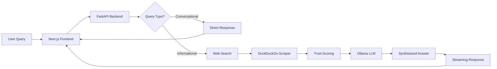

<div align="center">

# 🌐 GEO - Generative Engine Optimization

### *Trustworthy AI Search with Real-Time Web Sources & Inline Citations*

[](https://opensource.org/licenses/MIT)
[](https://www.python.org/downloads/)
[](https://nextjs.org/)
[](https://fastapi.tiangolo.com/)
[](https://ollama.ai/)

[Features](#-features) • [Demo](#-demo) • [Quick Start](#-quick-start) • [Architecture](#-architecture) • [Documentation](#-documentation) • [Contributing](#-contributing)

---

**GEO** is an intelligent AI-powered search assistant that searches the web in real-time, synthesizes information from credible sources, and provides answers with inline citations—just like Perplexity AI or SearchGPT, but **open-source** and **privacy-first**.

</div>

---

## ✨ Features

<table>
<tr>
<td width="50%">

### 🔍 **Real-Time Web Search**
- Live web scraping with DuckDuckGo
- No API keys required
- Up-to-date information every time

### 🎯 **Trust Scoring**
- Prioritizes `.gov`, `.edu`, and reputable domains
- GEO Protocol domain reputation scoring
- Transparent trust weights for every source

### 📚 **Inline Citations**
- Every fact linked to its source with `[1][2][3]`
- Click citations to view original sources
- Verify information yourself

</td>
<td width="50%">

### 🤖 **Local AI Synthesis**
- Powered by Ollama (runs on your machine)
- No data sent to external servers
- Privacy-first architecture

### 💬 **Conversational Interface**
- Chat-like interface with history
- Intelligent query detection
- Streaming responses in real-time

### ⚡ **Blazing Fast**
- Optimized query processing (~5-10s)
- Streaming token-by-token generation
- Responsive modern UI

</td>
</tr>
</table>

---

## 🎬 Demo

### Chat Interface
```
User: What is quantum computing?

GEO: Quantum computing is a type of computing that uses quantum-mechanical 
     phenomena like superposition and entanglement to perform operations on 
     data [1][2]. Unlike classical computers that use bits (0 or 1), quantum 
     computers use quantum bits or "qubits" that can exist in multiple states 
     simultaneously [3]. This allows quantum computers to solve certain 
     problems exponentially faster than classical computers [4][5].

📚 Sources:
[1] IBM Quantum Computing (ibm.com)
[2] What is Quantum Computing? - MIT Technology Review (technologyreview.com)
[3] Quantum Computing Explained - Nature (nature.com)
[4] Quantum Supremacy - Google Research (research.google)
[5] Introduction to Quantum Computing - IEEE (ieee.org)
```

### Key Capabilities
- ✅ **Conversational Queries**: "Hi", "Thanks!", "How are you?"
- ✅ **Factual Questions**: "What is Python?", "Who invented the telephone?"
- ✅ **Complex Topics**: "Explain quantum entanglement", "Latest AI research"
- ✅ **Current Events**: Real-time web search ensures fresh information

---

## 🚀 Quick Start

### Prerequisites
- **Python 3.13+**
- **Node.js 18+**
- **Ollama** ([Install here](https://ollama.ai/))

### 1️⃣ Clone the Repository
```bash
git clone https://github.com/StrungPattern-coder/GEO.git
cd GEO
```

### 2️⃣ Install Ollama & Model
```bash
# Install Ollama (macOS)
brew install ollama

# Start Ollama
ollama serve

# Pull the AI model (in a new terminal)
ollama pull qwen2.5:3b
```

### 3️⃣ Setup Backend
```bash
# Create virtual environment
python -m venv .venv
source .venv/bin/activate  # On Windows: .venv\Scripts\activate

# Install dependencies
pip install -r requirements.txt

# Configure environment
cp .env.example .env

# Start backend
./scripts/START_LOCAL.sh
```

### 4️⃣ Setup Frontend
```bash
# Open a new terminal
cd apps/web
npm install
npm run dev
```

### 5️⃣ Open in Browser
```
🚀 Frontend: http://localhost:3000
🔧 Backend API: http://localhost:8000
📊 API Health: http://localhost:8000/health
```

---

## 🏗️ Architecture



### Tech Stack

<table>
<tr>
<td><b>Frontend</b></td>
<td>Next.js 14, React, TypeScript, Tailwind CSS</td>
</tr>
<tr>
<td><b>Backend</b></td>
<td>FastAPI, Python 3.13, Pydantic</td>
</tr>
<tr>
<td><b>AI/LLM</b></td>
<td>Ollama (qwen2.5:3b, llama3, mistral)</td>
</tr>
<tr>
<td><b>Search</b></td>
<td>DuckDuckGo (real-time web scraping)</td>
</tr>
<tr>
<td><b>Database</b></td>
<td>Neo4j (optional for advanced features)</td>
</tr>
<tr>
<td><b>Monitoring</b></td>
<td>Prometheus, Structured Logging</td>
</tr>
</table>

---

## 🎯 How It Works

### 1. **Query Classification** 🧠
GEO intelligently detects if your query is:
- **Conversational**: "Hi", "Thanks", "How are you?" → Instant response
- **Informational**: "What is X?", "Explain Y" → Web search + AI synthesis

### 2. **Real-Time Web Search** 🔍
- Searches DuckDuckGo for your query
- Scrapes 8 most relevant results
- Applies GEO Protocol trust scoring (prioritizes `.gov`, `.edu`)

### 3. **AI Synthesis** 🤖
- Feeds search results to Ollama (local LLM)
- Generates concise, accurate answer
- Adds inline citations `[1][2][3]`

### 4. **Streaming Response** ⚡
- Streams answer token-by-token (like ChatGPT)
- Shows sources with clickable links
- Full transparency—verify everything!

---

## 📚 Documentation

- **[Quick Start Guide](docs/DEVELOPMENT.md)** - Detailed setup instructions
- **[GEO Protocol Spec](docs/GEO_PROTOCOL_SPEC.md)** - Trust scoring algorithm
- **[Real-Time Search](docs/REALTIME_WEB_SEARCH.md)** - Web search implementation
- **[Deployment Guide](docs/DEPLOYMENT_GUIDE.md)** - Production deployment
- **[Contributing Guide](CONTRIBUTING.md)** - How to contribute
- **[Changelog](CHANGELOG.md)** - Version history

---

## 🌟 Why GEO?

### vs. Traditional Search Engines
| Feature | Google | GEO |
|---------|--------|-----|
| AI-Synthesized Answers | ❌ (just links) | ✅ |
| Inline Citations | ❌ | ✅ |
| Privacy-First | ❌ (tracks you) | ✅ (local AI) |
| Open Source | ❌ | ✅ |
| Real-Time Search | ✅ | ✅ |

### vs. ChatGPT/Claude
| Feature | ChatGPT | GEO |
|---------|---------|-----|
| Real-Time Info | ❌ (training cutoff) | ✅ (live web) |
| Source Citations | ⚠️ (limited) | ✅ (every fact) |
| Privacy | ❌ (data sent to OpenAI) | ✅ (local) |
| Cost | 💰 ($20/month) | 🆓 (free) |

### vs. Perplexity AI
| Feature | Perplexity | GEO |
|---------|------------|-----|
| Open Source | ❌ | ✅ |
| Self-Hosted | ❌ | ✅ |
| Local LLM | ❌ | ✅ |
| Customizable | ❌ | ✅ |

---

## 🛣️ Roadmap

- [x] Real-time web search with DuckDuckGo
- [x] Ollama LLM integration
- [x] Inline citation system
- [x] Conversational query detection
- [x] Chat interface with history
- [x] Dark/light theme
- [ ] Multiple search providers (Google, Bing, Brave)
- [ ] Advanced query expansion
- [ ] Neo4j knowledge graph integration
- [ ] Multi-model LLM support (GPT-4, Claude)
- [ ] Browser extension
- [ ] Mobile app (React Native)
- [ ] RAG with document upload
- [ ] Image search and analysis

---

## 🤝 Contributing

We welcome contributions! Here's how to get started:

1. **Fork the repository**
2. **Create a feature branch**: `git checkout -b feature/amazing-feature`
3. **Make your changes** and test thoroughly
4. **Commit**: `git commit -m 'feat: add amazing feature'`
5. **Push**: `git push origin feature/amazing-feature`
6. **Open a Pull Request**

See [CONTRIBUTING.md](CONTRIBUTING.md) for detailed guidelines.

---

## 📄 License

This project is licensed under the **MIT License** - see the [LICENSE](LICENSE) file for details.

---

## 🙏 Acknowledgments

- **[Ollama](https://ollama.ai/)** - Local LLM runtime
- **[DuckDuckGo](https://duckduckgo.com/)** - Privacy-focused search
- **[FastAPI](https://fastapi.tiangolo.com/)** - Modern Python web framework
- **[Next.js](https://nextjs.org/)** - React framework
- **[Neo4j](https://neo4j.com/)** - Graph database

---

## 📧 Contact

**Sriram Kommalapudi** - [@StrungPattern-coder](https://github.com/StrungPattern-coder)

**Project Link**: [https://github.com/StrungPattern-coder/GEO](https://github.com/StrungPattern-coder/GEO)

---

<div align="center">

### ⭐ Star this repo if you find it useful!

Made by [Sriram Kommalapudi](https://github.com/StrungPattern-coder)

</div>
